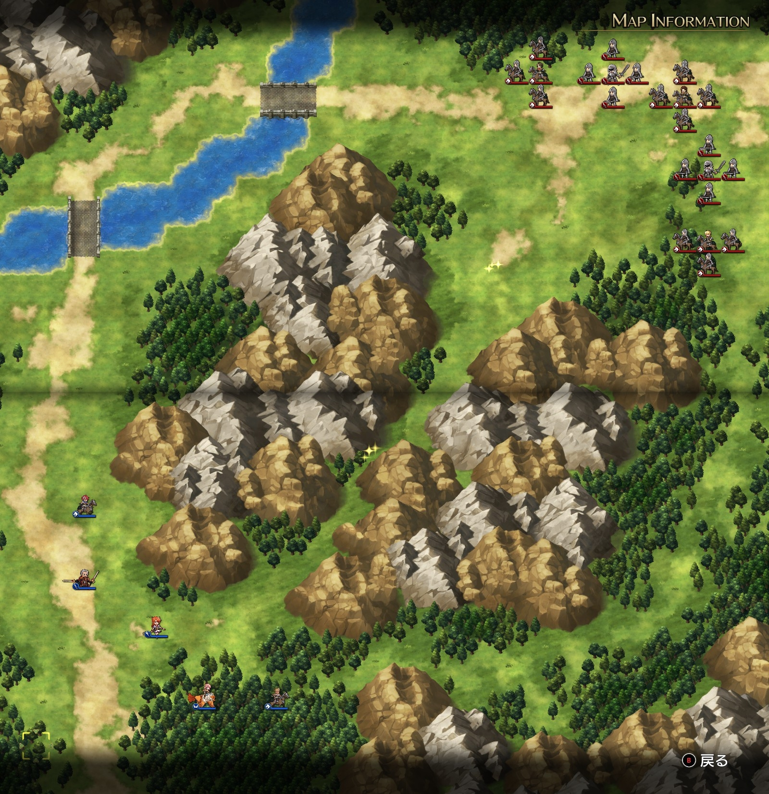

Steam 版ラングリッサーⅠ＆Ⅱリメイク > ラングリッサーⅠ

# A ルート 5 章：帝国軍親衛隊

## マップ

  

光るマス
- 中央北側、山岳入口
- 中央、峡谷

## 条件

- 勝利条件
    - ランスの撃破
- 敗北条件
    - レディンの死亡

## 敵軍

|指揮官|クラス|兵種|傭兵|傭兵兵種|
|---|---|---|---|---|
|ランス|シルバーナイト|騎兵|トルーパー|騎兵|
|レティシア|シルバーナイト|騎兵|ランサー|騎兵|
|ライアス|シルバーナイト|騎兵|ランサー|騎兵|
|帝国指揮官|ロード|歩兵|ソルジャー|歩兵|
|帝国指揮官|ロード|歩兵|ソルジャー|歩兵|

## 増援

なし

## 流れ

バルディア城に向かう途中、山岳部での戦闘マップです。

1 ターン目、北側にいるライアスと帝国指揮官は北回りで、東側にいるレティシアと帝国指揮官は東回りで攻め寄せてきます。

3 ターン目にはランスも動きます。状況に合わせて動くようですが、どちらかといえば北回りになりがちな気もします。

クリア後のイベントでヴォルコフが戦死し、仲間から外れます。ヴォルコフのアイテムは回収されるので、ヴォルコフの身ぐるみを剥いでおく必要はありません。

## 攻略メモ

### 出撃指揮官

|指揮官|クラス|傭兵|
|---|---|---|
|レディン|シルバーナイト|トルーパー|
|ヴォルコフ|ソードマスター|ランサー|
|クリス|クレリック|エルフ|
|ナーム|ホークロード|ハーピー|
|ソーン|シルバーナイト|トルーパー|

### 作戦

東回り（vs レティシア等）をソーン、ヴォルコフ、ナーム、北回り（vs ライアス等）をレディン、クリスとしました。

ナームの傭兵 1 ユニットは中央のアイテム回収に向かわせます。

レティシア、ライアスを撃破するまでは順調だったのですが、北回りで来たランスが強く苦戦しました。

いったん戦線を下げつつ、東回りの各隊を呼び戻して合流。全軍でランスに当たってどうにか撃破しました。

### 反省点

どんなものかと試しに使ってみたクリスのエルフが思いのほか弱かったというのもありますが、北回りの戦力が不足していました。

どちらかといえば北回りを充実した戦力にしたうえで、アタックなどのバフをかけて戦えば善戦できたのかなと思います。

  <a href="../README.md">［ホームへ戻る］</a>

