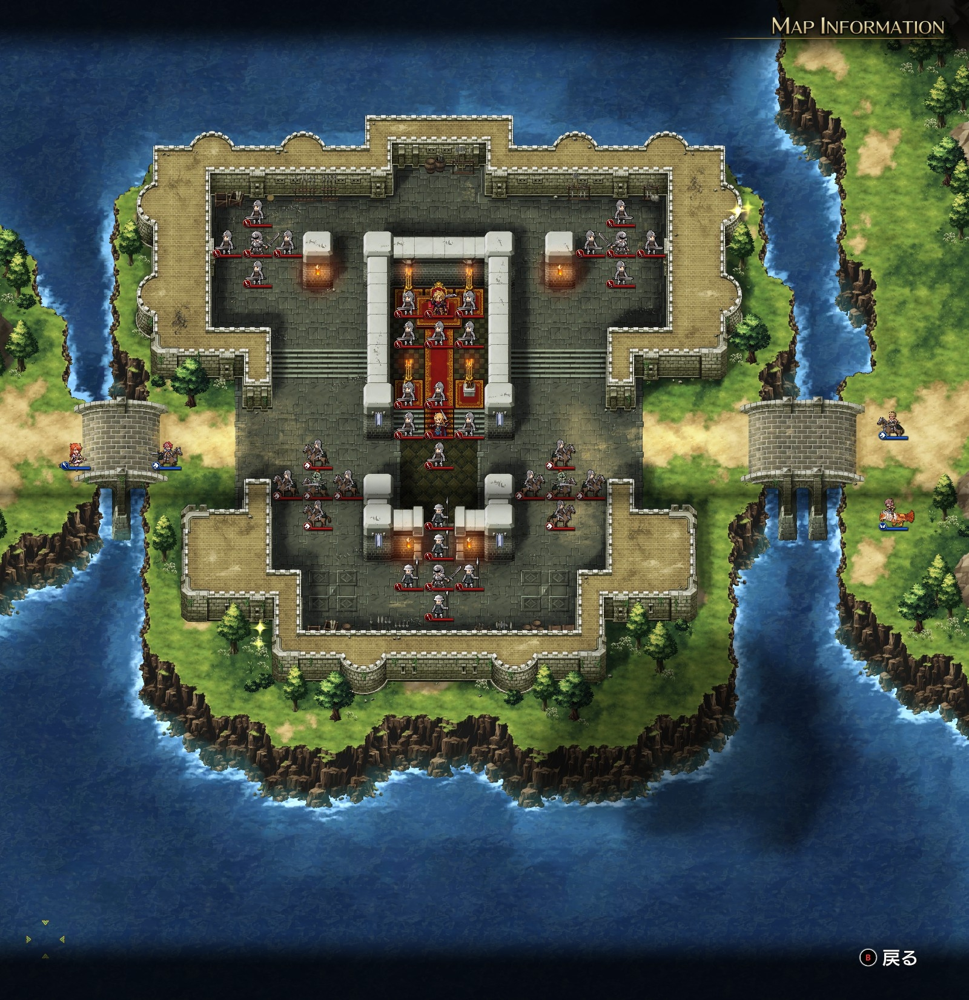

# A ルート 6 章：バルディア城の攻防

## マップ

  

光るマス
- 城の南西
- 城の北東

## 条件

- 勝利条件
    - ゼルドの撃破
- 敗北条件
    - レディンの死亡

## 敵軍

|指揮官|クラス|兵種|傭兵|傭兵兵種|
|---|---|---|---|---|
|ゼルド|ジェネラル|歩兵|ソルジャー|歩兵|
|セリア|ロード|歩兵|ソルジャー|歩兵|
|アントノフ|ロード|歩兵|パイク|槍兵|
|帝国指揮官|ロード|歩兵|ソルジャー|歩兵|
|帝国指揮官|ロード|歩兵|ソルジャー|歩兵|
|帝国指揮官|ナイト|騎兵|ランサー|騎兵|
|帝国指揮官|ナイト|騎兵|ランサー|騎兵|

## 増援

なし

## 流れ

追われたバルディア城を取り返すマップです。

左右の帝国指揮官 2 隊ずつ、計 4 隊は、1 ターン目から積極的に迎撃してきます。

それ以外は基本的には動きません。

## 攻略メモ

### 出撃指揮官

|指揮官|クラス|傭兵|
|---|---|---|
|レディン|ハイランダー|ドラグーン|
|クリス|クレリック|モンク|
|ナーム|ホークロード|ハーピー|
|ソーン|シルバーナイト|トルーパー|

### 作戦

一度に多くの敵を相手にしないよう、城壁の隙間などを活用しながらじわじわと攻めました。

敵の中で一番厄介なゼルド隊はみな歩兵なので、最後は騎兵での一斉攻撃で落としました。

### 反省点

今回はなかなか上手くいったのではと思います。

  <a href="../README.md">［ホームへ戻る］</a>

