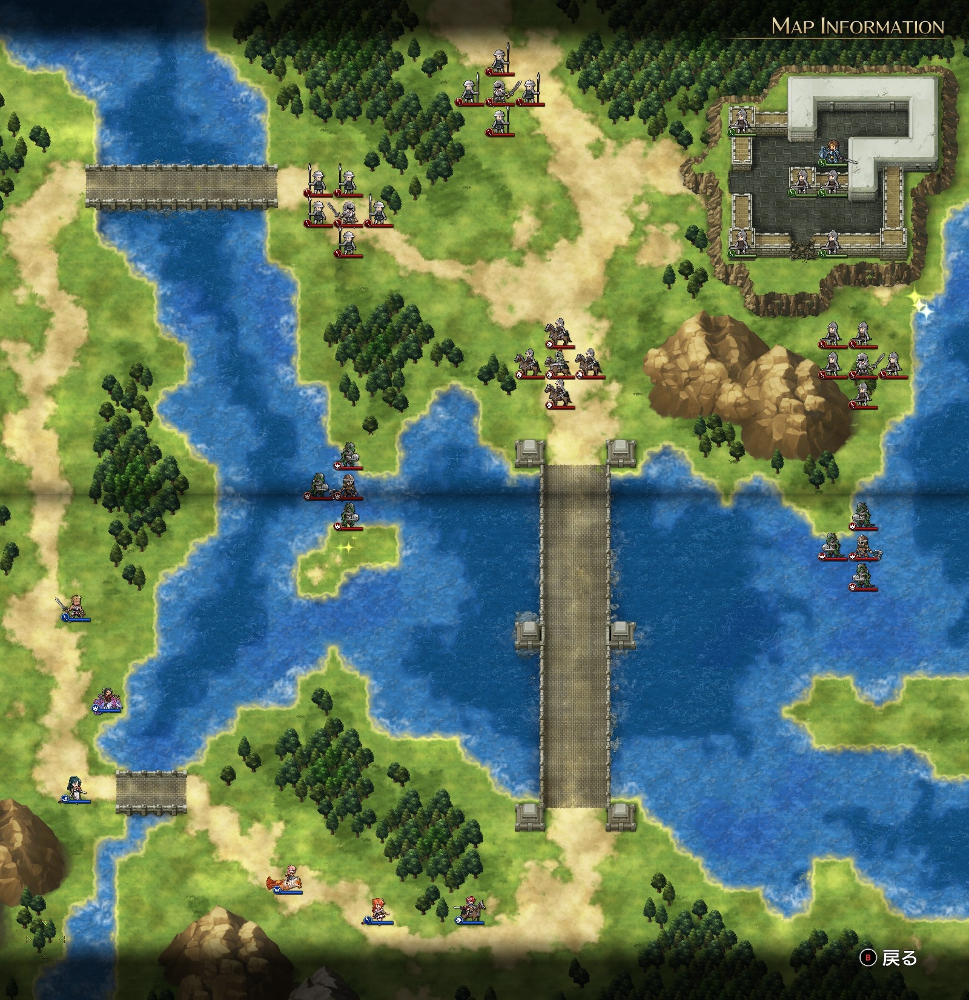

Steam 版ラングリッサーⅠ＆Ⅱリメイク > ラングリッサーⅠ

# A ルート 7 章：砦の勇者

## マップ

  

光るマス
- 中央西寄りの中州
- 砦の南東

## 条件

- 勝利条件
    - ベルヌーイの撃破
- 敗北条件
    - レディンの死亡
    - アルバートの死亡
- クリアボーナス
    - 3,500 G

## 敵軍

|指揮官|クラス|兵種|傭兵|傭兵兵種|
|---|---|---|---|---|
|ベルヌーイ|ロード|歩兵|ソルジャー|歩兵|
|ネルウィー|ロード|歩兵|パイク|槍兵|
|帝国指揮官|ロード|歩兵|パイク|槍兵|
|帝国指揮官|シルバーナイト|騎兵|ランサー|騎兵|
|帝国指揮官|パイレーツ|水兵|リザードマン|水兵|
|帝国指揮官|パイレーツ|水兵|リザードマン|水兵|

## 増援

|出現ターン|出現位置|指揮官|クラス|兵種|傭兵|傭兵兵種|
|---|---|---|---|---|---|---|
|5 ターン目|南端東寄り|ランス|ハイランダー|騎兵|トルーパー|騎兵|
|5 ターン目|南端東寄り|ライアス|シルバーナイト|騎兵|ランサー|騎兵|
|5 ターン目|南端東寄り|レティシア|シルバーナイト|騎兵|ランサー|騎兵|

## 流れ

砦で孤軍奮闘するアルバート（NPC）の救出に向かうマップです。

敵軍は、北側の帝国指揮官 2 隊は 1 ターン目から、ベルヌーイが 2 ターン目から、それぞれ砦に向かいます。

その他の敵軍は、時間差はありますが（1～3 ターン目に移動開始）、自軍に向かってきます。

5 ターン目には、ランス達が橋の南側に出現します。

クリア後、アルバートが仲間になります。

## 攻略メモ

### 出撃指揮官

|指揮官|クラス|傭兵|
|---|---|---|
|レディン|ハイランダー|トルーパー|
|クリス|プリースト|モンク|
|ナーム|ホークロード|ハーピー|
|ジェシカ|メイジ|モンク|
|ソーン|ハイロード|トルーパー|
|テイラー|サーペンナイト|リザードマン|

### 作戦

三方から救出の手を延べる作戦にしました。

第一救出部隊は、西側から北回りで侵攻するソーン。本人は歩兵ですが、スピードブーツ（MOV+1）を装備しているので、隊全員の MOV が 6 です。

第二救出部隊は、正面の橋を北上するレディン。

第三救出部隊は、正面の橋の東側を飛行するナーム。

このうち、レディンは狭い橋の上での戦闘を強いられて時間を要したため、結果として増援ランス抑え要因として引き続き橋に居座ることにしました。

このため、ソーン（＋後続のジェシカ）が砦の西側に、ナームが砦の南側にそれぞれ取り付きました。

砦のアルバートは 3 隊に攻め寄せられて大変ではあるものの、砦が狭いのと、アルバート自身が強いので、見た目ほどピンチではありません。

加えて、ソーンとナームが取り付くことにより、アルバートへの圧が和らいだので、傭兵から順に撃破していく程度の余裕はありました。

増援のランス達に対しては、橋に居座ったレディン（＋後続のクリス）の他、横の浅瀬からテイラーがちくちくと攻撃して撃破しました。

### 反省点

今回はなかなか上手くいったのではと思います。

  <a href="../README.md">［ホームへ戻る］</a>

