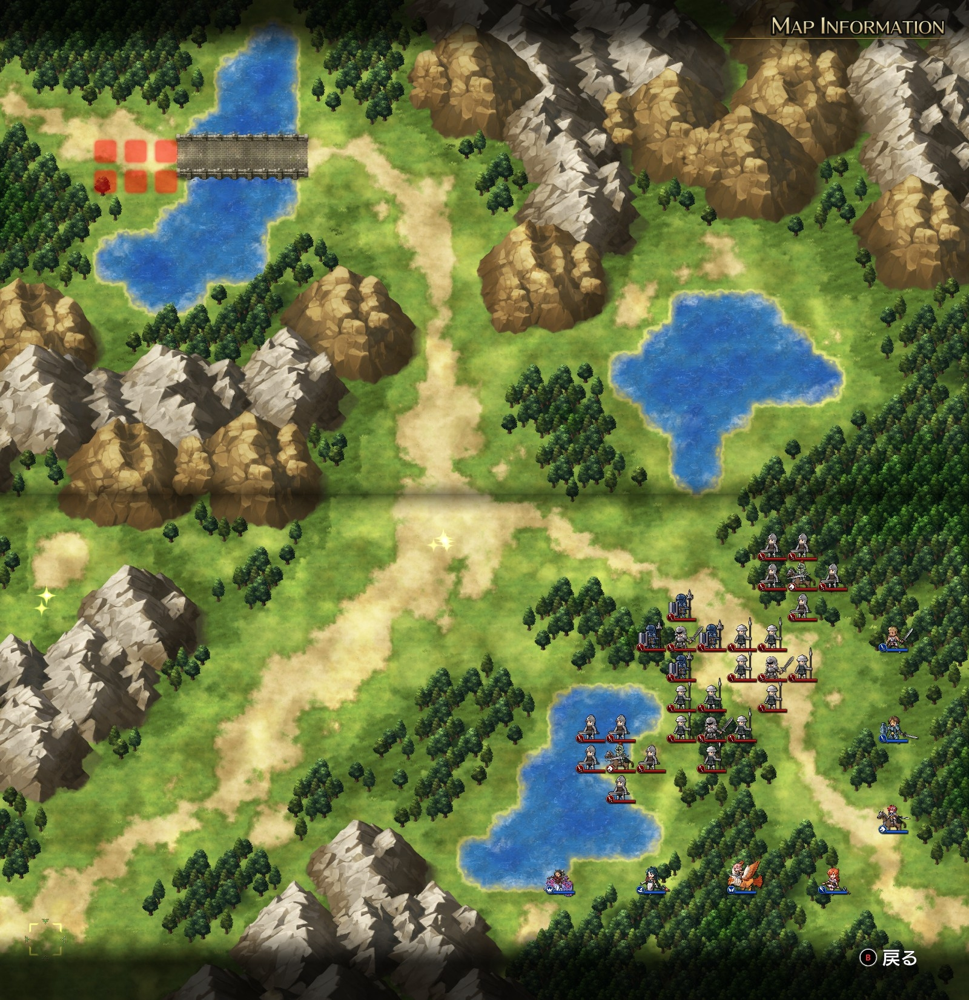

# A ルート 8 章：追撃

## マップ

  

光るマス
- 西側中央
- 中央三叉路

## 条件

- 勝利条件
    - ザルダフの撃破
- 敗北条件
    - レディンの死亡
    - ザルダフの逃亡

## 敵軍

|指揮官|クラス|兵種|傭兵|傭兵兵種|
|---|---|---|---|---|
|ザルダフ|ハイロード|歩兵|ファランクス|槍兵|
|帝国指揮官|ロード|歩兵|パイク|槍兵|
|帝国指揮官|ロード|歩兵|パイク|槍兵|
|帝国指揮官|シルバーナイト|騎兵|ソルジャー|歩兵|
|帝国指揮官|シルバーナイト|騎兵|ソルジャー|歩兵|

## 増援

|出現ターン|出現位置|指揮官|クラス|兵種|傭兵|傭兵兵種|
|---|---|---|---|---|---|---|
|3 ターン目|南西の街道|ランス|ハイランダー|騎兵|トルーパー|騎兵|
|3 ターン目|南西の街道|ライアス|シルバーナイト|騎兵|ランサー|騎兵|
|3 ターン目|南西の街道|レティシア|シルバーナイト|騎兵|ランサー|騎兵|

## 流れ

1 ターン目は、敵は迎撃以外では動きません。

2 ターン目から、ザルダフおよび、ロードの帝国指揮官 2 隊が逃げ出します。ザルダフは北東の湖の南側を掠めるような退路を取ります。

一方、シルバーナイトの帝国指揮官 2 隊は自軍に向かってきます。

3 ターン目には増援のランス達が到着します。ランス達は、自軍が遠ければザルダフを目標に移動するようです。

## 攻略メモ

### 出撃指揮官

|指揮官|クラス|傭兵|
|---|---|---|
|レディン|ハイランダー|トルーパー|
|クリス|プリースト|モンク|
|ナーム|ホークロード|ハーピー|
|ジェシカ|メイジ|ファランクス|
|アルバート|ロード|ソルジャー|
|ソーン|ハイロード|トルーパー|
|テイラー|サーペンナイト|リザードマン|

### 作戦

北側に配置した機動力の高いレディンとソーンでザルダフを追いかけるものの、騎兵なのでザルダフを守るファランクスと相性が悪く苦戦しました。

最終的には、ナームが山岳地帯に追い詰めて足止めし、アルバートで倒しました。

ナームの傭兵 1 ユニットは、西側のアイテム回収のために単独行動しています。

増援のランス達は西側に配置したテイラーとジェシカで抑える予定でしたが、ジェシカは間に合わずほとんど戦闘に参加できませんでした。

### 反省点

ザルダフの追撃もランスの迎撃もうまくいきませんでした。

最初から追い詰めポイントを山岳地帯に設定し、ナームは全力で峡谷に向かって峡谷を封鎖するのがいいのかもしれません。

ランス迎撃目標ポイントは三叉路あたりでしょうか。

次回があるとすれば、配置は北から順に縦にナーム、槍兵（ランス迎撃用）、歩兵（ザルダフ討伐用）。一番西がテイラー（ランス迎撃用）、その他の 3 隊はシルバーナイト迎撃用、というあたりでやってみようかと思います。

  <a href="../README.md">［ホームへ戻る］</a>

