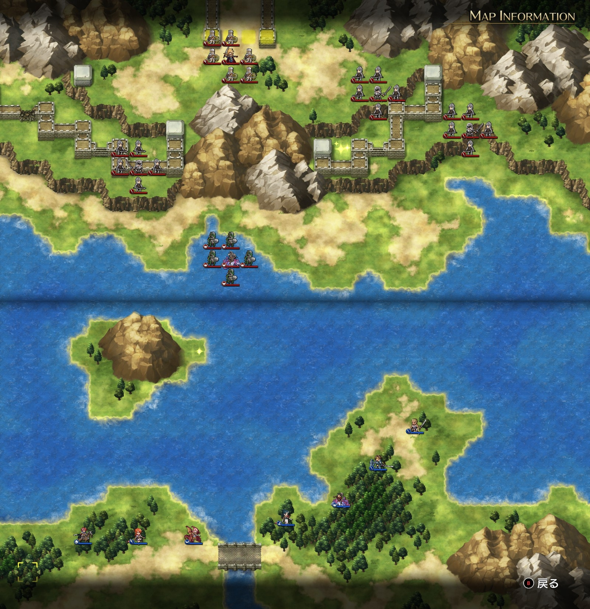

# A ルート 9 章：ワールの激流

## マップ

  

光るマス
- 島の東端
- 北東の城壁

## 条件

- 勝利条件
    - 敵の全滅
    - レディンが街道に到達
- 敗北条件
    - レディンの死亡

## 敵軍

|指揮官|クラス|兵種|傭兵|傭兵兵種|
|---|---|---|---|---|
|セリア|ロード|歩兵|クルセイダー|僧侶|
|ガルヴェス|ロード|歩兵|ソルジャー|歩兵|
|スカルディス|サーペンナイト|水兵|リザードマン|水兵|
|帝国指揮官|ロード|歩兵|ソルジャー|歩兵|
|帝国指揮官|ロード|歩兵|ソルジャー|歩兵|

## 増援

|出現ターン|出現位置|指揮官|クラス|兵種|傭兵|傭兵兵種|
|---|---|---|---|---|---|---|
|4 ターン目|川の西端北側|クラーケン（第三勢力）|クラーケン|怪物水|リヴァイアサン|怪物水|
|4 ターン目|川の東端北側|クラーケン（第三勢力）|クラーケン|怪物水|リヴァイアサン|怪物水|
|5 ターン目|北西城壁付近|ランス|ハイランダー|騎兵|トルーパー|騎兵|

## 流れ

増援のランスが来るまでは、敵は迎撃以外では動きません。スカルディスは比較的迎撃範囲が大きめな印象です。

4 ターン目で川の東西端にそれぞれクラーケンが出現しますが、敵味方構わず襲います。

5 ターン目で増援のランスが出現すると、敵軍が打って出てきます。

## 攻略メモ

### 出撃指揮官

|指揮官|クラス|傭兵|
|---|---|---|
|レディン|ハイランダー|トルーパー|
|クリス|プリースト|モンク|
|ナーム|ドラゴンナイト|ハーピー|
|ジェシカ|メイジ|モンク|
|アルバート|ソードマン|ソルジャー|
|ソーン|ハイロード|トルーパー|
|テイラー|サーペンナイト|リザードマン|

### 作戦

一番楽なのは、5 ターンの間一歩も動かなければ、クラーケンと帝国軍が打ち合って損耗するので、悠々と渡河できるのではないかと思います。

しかし今回は経験値を狙うために、すべてを狩るつもりで行動しました。

西側では水兵のテイラー隊と地形の影響を受けない飛兵ナーム隊のコンビが、スカルディスを誘い出して水中戦を行います。この時、あまり東側に行かないようにします（東側のクラーケンが寄ってきてしまうので）。

やや遅れて、レディンが島中央に出撃し、後方にはクリスが控えて、西側クラーケンに備えます。

東側では、クラーケンをおびき寄せる傭兵を少しだけ突出させつつ（そうしないとテイラー隊のほうに行ってしまうので）待機。

クラーケン出現後は、必死の防衛戦です。クラーケンはかなり強いです。

西側では、レディンが山岳の防御を活かして戦い、なんとか損耗を抑えて勝利。一方で、クリスは位置取りが悪く、あまり活躍できませんでした。

そのままランスらと交戦。自軍は陸上（島）、敵軍は水上と、位置取りは完璧ながらも、ランスは強いです。なんとか激戦を勝ち抜きました。

東側では、ソーン・アルバートの前衛組がばったばったとやられるものの、ジェシカが魔法無双でクラーケン隊をなぎ倒していきます。

その後の敵軍は弱いです。地の利もあって苦も無く倒せました。やや時間稼ぎをしながら、対岸のアイテム回収もしておきます。

  <a href="../README.md">［ホームへ戻る］</a>

