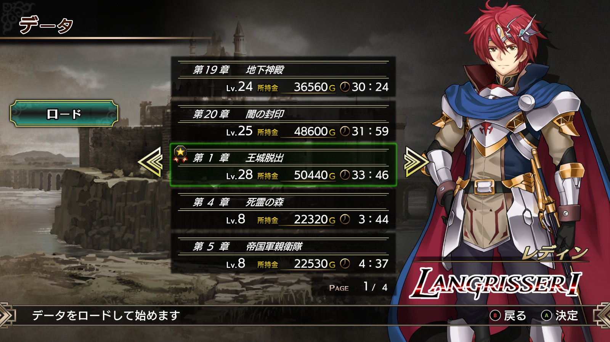
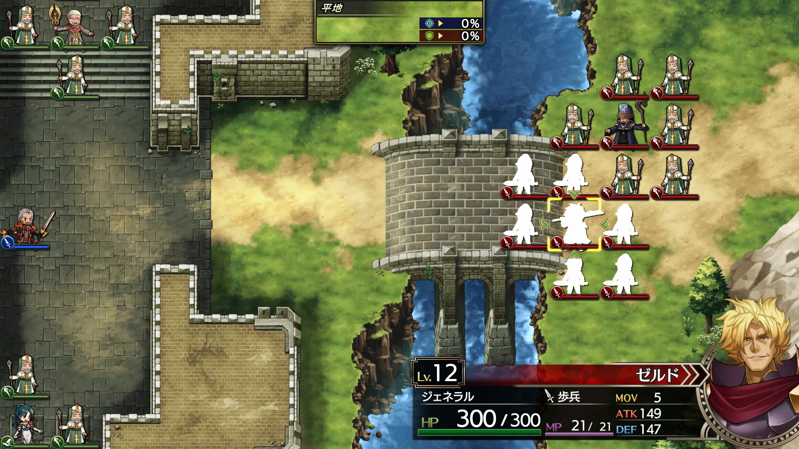
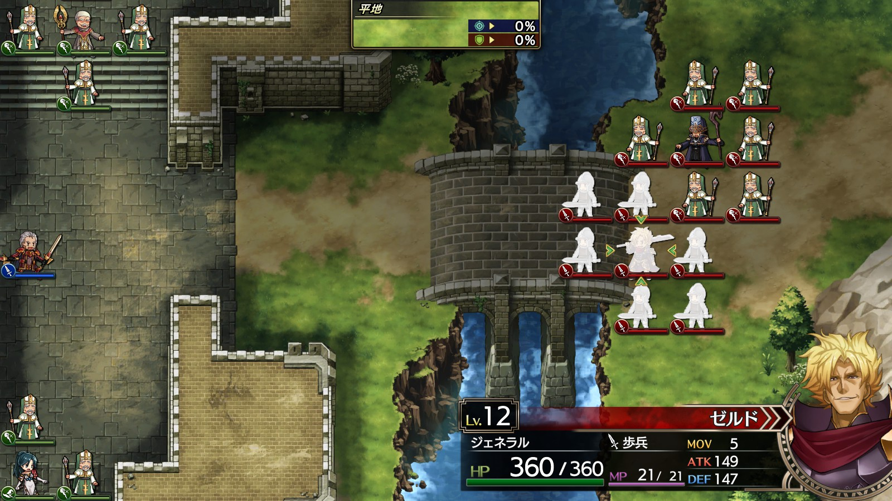

Steam 版ラングリッサーⅠ＆Ⅱリメイク > ラングリッサーⅠ

# 周回プレイ

クリア直後のデータをタイトル画面からロードすると、周回プレイをすることができます。

  

周回プレイ開始時、以下の中からプレイスタイルを選べます。
- ステータスを引き継いで周回
- ステータス引き継ぎ無しでチャレンジモードを開始
- ステータス引き継ぎ有りでチャレンジモードを開始

ステータスを引き継ぐと、ステータス、所持アイテム、所持金等が引き継がれます。

チャレンジモードにすると、敵の HP が約 20% 上がります。例えば、1 章のゼルドは 300 → 360、サー・ガリウスは 240 → 280 になります。

通常のゼルドのステータス。

  

チャレンジモードのゼルドのステータス。

  

なお、クリア直後のデータを上書きすると（例え 1 章のままであっても）、周回プレイスタイルを選べなくなります。

  <a href="../README.md">［ホームへ戻る］</a>

