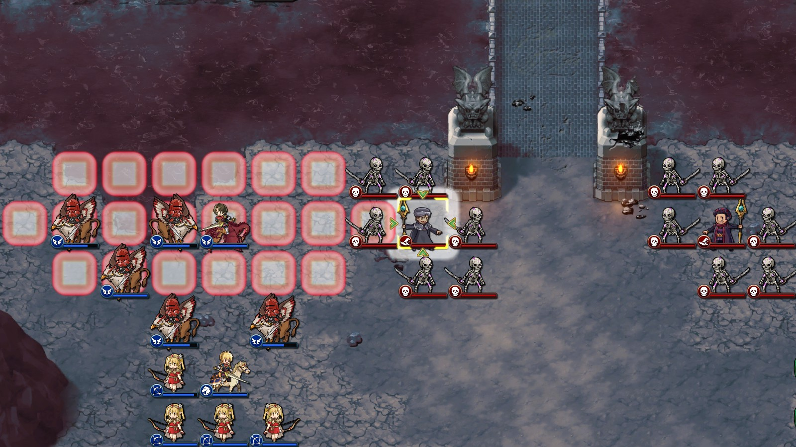
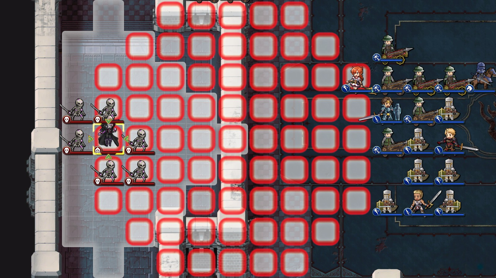
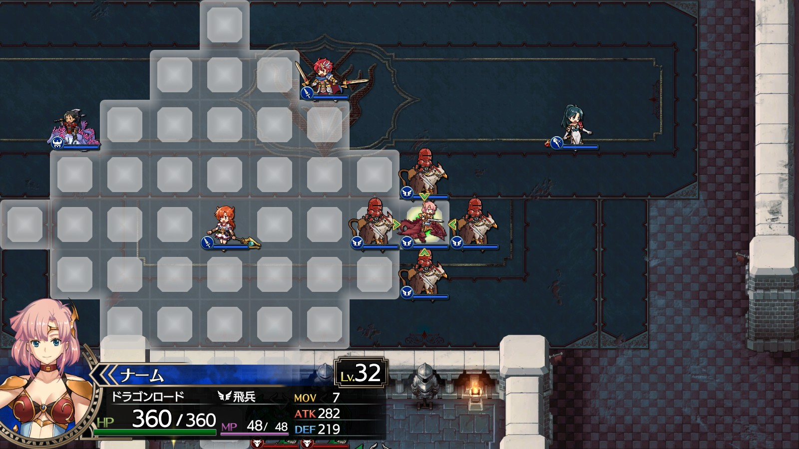
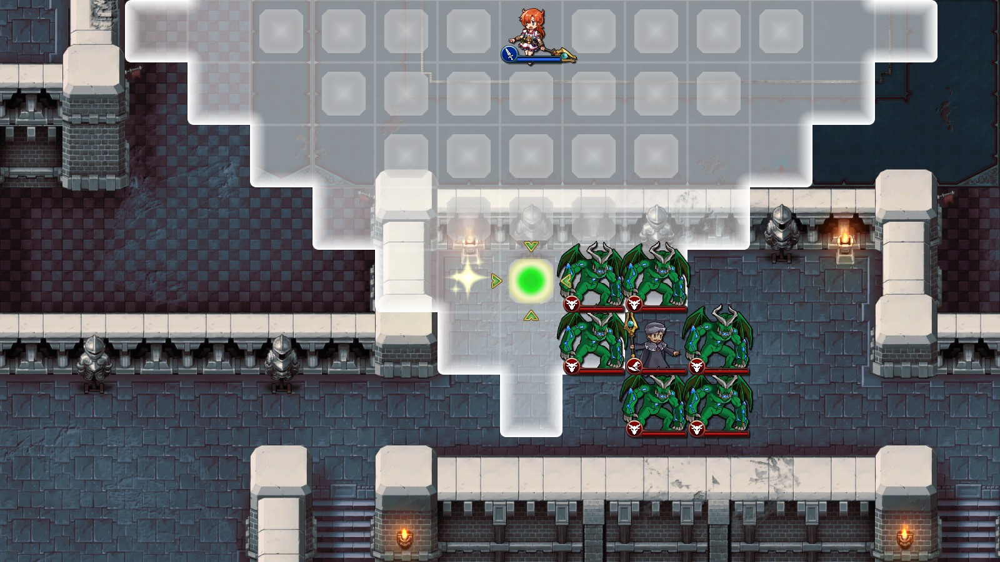

Steam 版ラングリッサーⅠ＆Ⅱリメイク > ラングリッサーⅠ

# 特殊範囲魔法

### コールドウェイブ

魔法リスト画面上では射程が 6 マスに見えますが、実際には、射程 8 マスあります。

  

### メテオ

最大 8 マス（術者含めて 9 マス）の射程があり、円状に効果範囲があります。

  

### テレポート

4 マス以内にいる指揮官を、6 マス以内の任意の場所に移動させます。

この時、配下の傭兵も一緒に移動させます。傭兵は 4 マスよりはみ出ていても移動させます。

  

  

  <a href="../README.md">［ホームへ戻る］</a>

